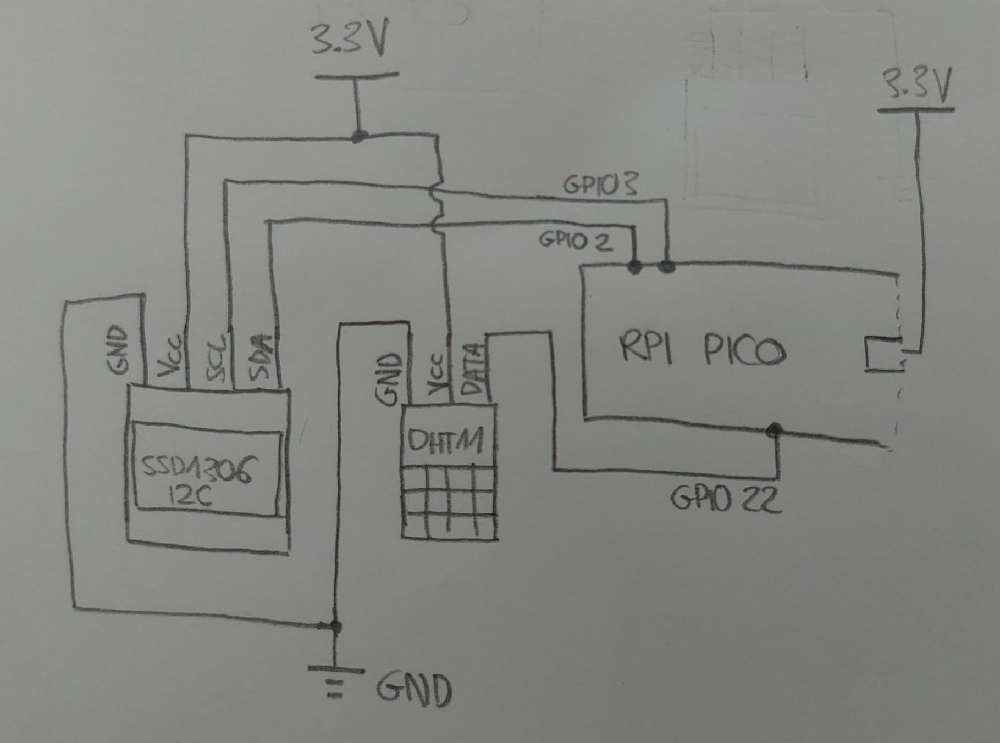
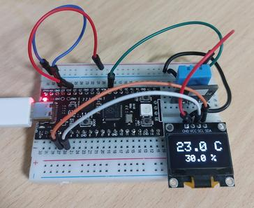

# Pico climate monitor

Climate monitor using a raspberry pi pico, which gathers temperature and humidity data periodically from a dht11 sensor. The information is showed in ssd1306 oled display.

## Schematic & pin layout

| RPI Pico pin | SSD1306 pin | DHT11 pin
|--------------|-------------|------|
| GPIO 3       | SDA         | -
| GPIO 2       | SCL         | -
| GPIO 22      | -           | DATA

## Building & loading

1. Clone the repository:  
`git clone https://github.com/jjoanr/pico_climate_monitor.git`
2. Cd into it and create a build folder.  
`cd pico_climate_monitor && mkdir build`
3. Export the enviroment variable PICO_SDK_PATH:  
`export PICO_SDK_PATH=/path/to/the/pico-sdk`
4. Cd into it and and execute cmake:  
`cd build && cmake ..`
5. A Makefile among other files will be generated. Execute the makefile:  
`make`
6. Finally, upload the main.uf2 into the pico. I used *picotool* as follows:  
`picotool load main.uf2`

